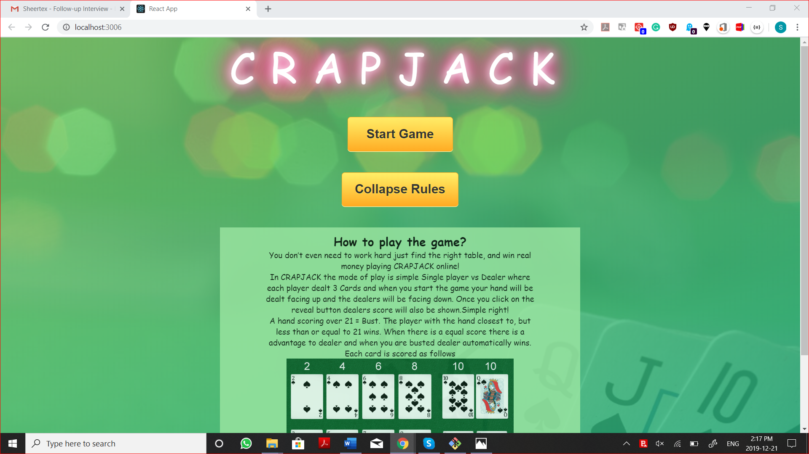

This project was bootstrapped with [Create React App](https://github.com/facebook/create-react-app).

## Available Scripts

In the project directory, you can run:

### `npm start`

Runs the app in the development mode. 
Open [http://localhost:3000](http://localhost:3000) to view it in the browser.

The page will reload if you make edits. 
You will also see any lint errors in the console.

Home screen contains expand and collapse rules button and also a Start Game button to start the game the UI is as shown in the below figure

Expand collapse once the user clicks on the view rules button the content is expanded and the button changes to collapse rules, now if the user clicks on the collapse rules button the rules will be collapsed. 

When the user clicks on the start button the game is started and the UI is as shown in the below figure.

By default, the user hand is open the user can click on the reveal button to view the dealer score as well. 

Once the user clicks on the reveal button the dealer’s score will also be shown and based on the rules the winner will be displayed.
In the below case the winner is user; which will be shown with cool animations. 

In the below case the winner is the dealer. All the other cases will be displayed. 

